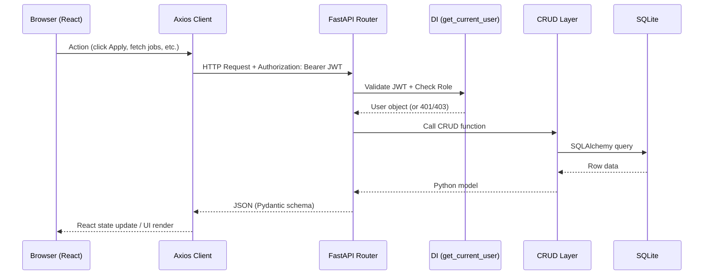
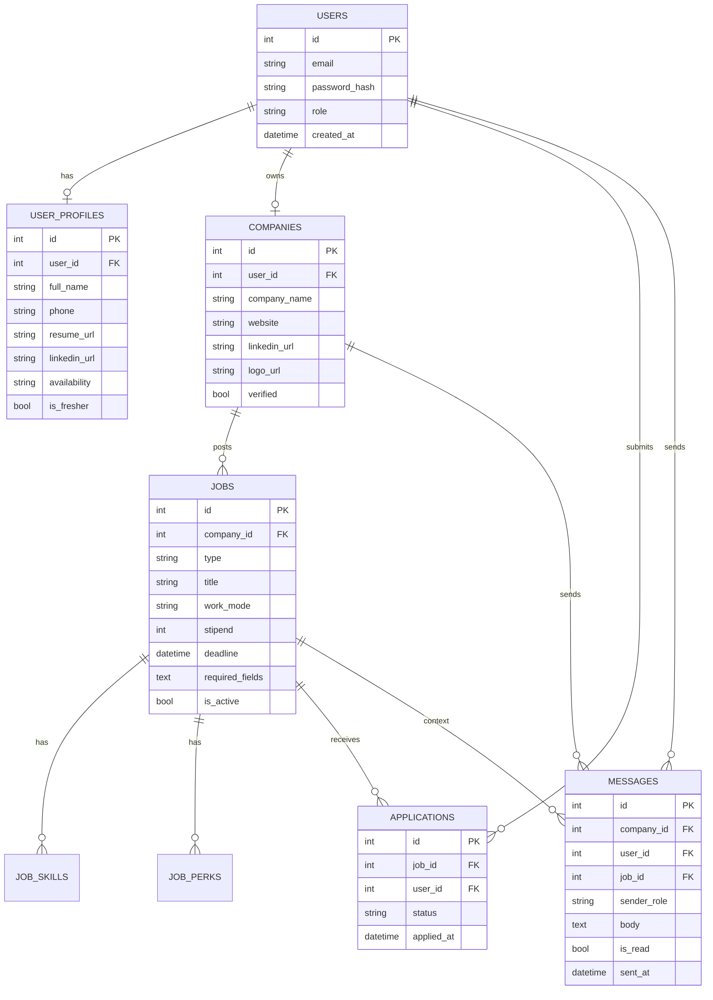
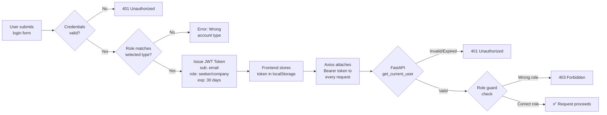

<div align="center">

# 🚀 Aumne — Job Portal Platform

**A full-stack hiring platform connecting Job Seekers with Companies**

[](https://fastapi.tiangolo.com)
[](https://reactjs.org)
[](https://sqlite.org)
[](https://tailwindcss.com)
[](https://python.org)
[](LICENSE)

[Live Demo](#) · [API Docs](http://localhost:8000/docs) · [Report Bug](#) · [Request Feature](#)

</div>

---

## 📑 Table of Contents

- [About the Project](#-about-the-project)
- [Key Features](#-key-features)
- [System Architecture](#-system-architecture)
- [Technology Stack](#-technology-stack)
- [Database Schema](#-database-schema)
- [API Reference](#-api-reference)
- [Project Structure](#-project-structure)
- [Getting Started](#-getting-started)
- [Authentication & Security](#-authentication--security)
- [Business Rules](#-business-rules)
- [Testing](#-testing)
- [SDK](#-sdk)
- [Feature Changelog](#-feature-changelog)

---

## 🎯 About the Project

**Aumne** is a production-grade Job Portal platform built as a full-stack application with a FastAPI backend and a React (Vite) SPA frontend. It supports the complete hiring lifecycle — from job discovery and application to applicant management, status tracking, and real-time in-app messaging.

The platform enforces strict role separation between **Job Seekers** and **Companies** and implements two core business rules at the database, API, and UI layers: **duplicate application prevention** and **deadline enforcement**.

| Role | Capabilities |
|------|-------------|
| 🧑‍💼 **Job Seeker** | Browse jobs & internships, apply, edit profile inline, track application status, chat with companies |
| 🏢 **Company** | Post jobs/internships with custom requirements, manage applicants, update statuses, message candidates |
| 👤 **Guest** | Browse job cards — full detail and apply requires login |

---

## ✨ Key Features

- 🔐 **JWT Authentication** with role-based access control (Seeker / Company)
- 🛑 **Role-aware Login** — mismatch guard prevents wrong-account logins
- 📋 **Job & Internship Listings** with search, filter, and deadline tracking
- 📝 **Smart Apply Modal** — inline profile editing, required-field validation, no page redirect
- ✅ **Duplicate Prevention** — UI badge + API 409 + DB UNIQUE constraint
- 📁 **In Progress Tab** — seekers can continue or delete pending applications
- 🏷️ **Company Required Fields** — per-job applicant data requirements (Phone, LinkedIn, etc.)
- 🔗 **Company Profile Links** — external website and LinkedIn from job detail page
- 💬 **In-App Messaging** — threaded conversations per job application
- 🔔 **Real-time Badge** — unread message count in navbar, auto-clears when thread opened
- 📂 **File Uploads** — resume (PDF) and company logo storage
- 🧪 **Unit Tests** — 12 test cases across auth, jobs, and applications
- 🤖 **Auto-generated Python SDK** from OpenAPI spec

---

## 🏗️ System Architecture

```mermaid
graph TB
    subgraph BROWSER["🌐 Browser — React + Vite (Port 5173)"]
        LP[LandingPage]
        AP[AuthPages<br/>Role Picker + Login/Signup]
        JP[JobsPage<br/>Listings + Filters]
        JD[JobDetailPage<br/>Apply Flow]
        SD[SeekerDashboard<br/>Profile + Applications]
        CD[CompanyDashboard<br/>Post Jobs + Applicants]
        IP[InboxPage<br/>Messages]
        NB[Navbar<br/>Badge + Role Links]
        AM[ApplyModal<br/>Inline Edit]
    end

    subgraph AXIOS["📡 Axios HTTP Client"]
        AC[api/client.js<br/>JWT Bearer Interceptor]
        AF[api/jobs.js<br/>All API Functions]
    end

    subgraph API["⚙️ FastAPI — Uvicorn (Port 8000)"]
        subgraph ROUTERS["Routers"]
            R1[/auth]
            R2[/jobs]
            R3[/internships]
            R4[/users]
            R5[/companies]
            R6[/messages]
        end
        subgraph MIDDLEWARE["Middleware / DI"]
            JWT[JWT Decoder<br/>get_current_user]
            RG[Role Guards<br/>require_seeker<br/>require_company]
            DB[DB Session<br/>get_db]
        end
        subgraph LOGIC["Business Logic"]
            BL1[Deadline Check]
            BL2[Duplicate Check]
            BL3[Required Fields Validation]
        end
        CRUD[crud.py<br/>All DB Operations]
        SCH[schemas.py<br/>Pydantic v2 Validation]
    end

    subgraph DATA["💾 Data Layer"]
        DB1[(SQLite<br/>job_portal.db)]
        FS[/uploads/<br/>Resumes + Logos]
    end

    subgraph SDK["🤖 Python SDK"]
        SK[job_sdk/<br/>Auto-generated via OpenAPI Generator]
    end

    BROWSER --> AXIOS
    AXIOS --> API
    API --> CRUD
    CRUD --> DB1
    API --> FS
    API --> SDK
```

### 🔄 Request Flow



### 🗄️ Data Relationships



---

## 🛠️ Technology Stack

### Backend

| Category | Technology | Version |
|----------|-----------|---------|
| Web Framework | **FastAPI** | 0.111.0 |
| ASGI Server | **Uvicorn** | 0.29.0 |
| ORM | **SQLAlchemy** | 2.0.30 |
| Migrations | **Alembic** | 1.13.1 |
| Validation | **Pydantic v2** | 2.7.1 |
| Auth | **python-jose (JWT)** | 3.3.0 |
| Passwords | **passlib (bcrypt)** | 1.7.4 |
| File Uploads | **python-multipart** | 0.0.9 |
| Testing | **pytest + httpx** | 8.2.0 / 0.27.0 |
| Database | **SQLite** | 3.x |

### Frontend

| Category | Technology | Version |
|----------|-----------|---------|
| Framework | **React** | 18+ |
| Build Tool | **Vite** | Latest |
| Routing | **React Router v6** | Latest |
| HTTP Client | **Axios** | Latest |
| Styling | **Tailwind CSS** | v3 |
| Icons | **Lucide React** | Latest |

### DevOps & Tooling

| Tool | Purpose |
|------|---------|
| **Git + GitHub** | Version control (`Sujitha1306/Aumne`) |
| `master_launcher.bat` | One-click start for both servers |
| `setupdev.bat` | Dev environment setup (venv, migrations, npm install) |
| `openapi-generator-cli` | Auto-generates Python SDK from live OpenAPI spec |

---

## 🗃️ Database Schema

The database contains **8 tables** managed by SQLAlchemy ORM and versioned through Alembic.

| Table | Purpose | Key Columns |
|-------|---------|-------------|
| `users` | Auth for both roles | `email UNIQUE`, `password_hash`, `role` |
| `user_profiles` | Seeker personal info | `resume_url`, `linkedin_url`, `availability`, `is_fresher` |
| `companies` | Recruiter org details | `company_name`, `website`, `linkedin_url`, `verified` |
| `jobs` | Job & internship postings | `type`, `work_mode`, `stipend`, `deadline`, `required_fields (JSON)` |
| `job_skills` | Skills per posting (many-to-one) | `job_id FK`, `skill_name` |
| `job_perks` | Perks per posting (many-to-one) | `job_id FK`, `perk_name` |
| `applications` | Submission records | `UNIQUE(job_id, user_id)`, `status`, `applied_at` |
| `messages` | In-app chat threads | `sender_role`, `body`, `is_read`, `sent_at` |

> **Application statuses:** `under_review` → `shortlisted` → `hired` / `rejected`

---

## 📡 API Reference

### Authentication `/auth`

| Method | Endpoint | Auth | Description |
|--------|----------|------|-------------|
| `POST` | `/auth/signup` | ❌ | Register seeker or company |
| `POST` | `/auth/login` | ❌ | Login — returns JWT token |
| `GET` | `/auth/me` | ✅ | Current user + profile/company data |

### Jobs `/jobs` & `/internships`

| Method | Endpoint | Auth | Description |
|--------|----------|------|-------------|
| `GET` | `/jobs/` | Optional | List all active job postings |
| `POST` | `/jobs/` | Company | Create a job posting |
| `GET` | `/jobs/{id}` | Optional | Full job detail |
| `POST` | `/jobs/{id}/apply` | Seeker | Submit application *(enforces both business rules)* |
| `GET` | `/jobs/{id}/applicants` | Company | All applicants for a posting |

> `/internships/` mirrors all `/jobs/` endpoints.

### Users `/users`

| Method | Endpoint | Auth | Description |
|--------|----------|------|-------------|
| `GET` | `/users/profile` | Seeker | Fetch own profile |
| `PUT` | `/users/profile` | Seeker | Update profile fields |
| `POST` | `/users/resume` | Seeker | Upload resume PDF |
| `GET` | `/users/applications` | Seeker | My applications list |
| `DELETE` | `/users/applications/{id}` | Seeker | Withdraw an application |

### Companies `/companies`

| Method | Endpoint | Auth | Description |
|--------|----------|------|-------------|
| `GET` | `/companies/profile` | Company | Own company profile |
| `PUT` | `/companies/profile` | Company | Update company info |
| `POST` | `/companies/logo` | Company | Upload company logo |
| `GET` | `/companies/{id}` | Optional | Public company profile |

### Messages `/messages`

| Method | Endpoint | Auth | Description |
|--------|----------|------|-------------|
| `POST` | `/messages/` | Any | Send a message |
| `GET` | `/messages/inbox` | Seeker | Seeker inbox |
| `GET` | `/messages/company-inbox` | Company | Company received messages |
| `GET` | `/messages/unread-count` | Any | Badge count (`is_read = False`) |
| `GET` | `/messages/thread/{job_id}/{user_id}` | Any | Thread + marks as read |

### Error Codes

| HTTP | Scenario |
|------|---------|
| `401` | Invalid or expired JWT |
| `403` | Wrong role for endpoint |
| `404` | Resource not found |
| `409` | Duplicate application |
| `422` | Deadline passed / Pydantic validation failure |
| `500` | Server / database error |

---

## 📁 Project Structure

```
Aumne/
├── 📂 backend/
│   ├── main.py                     # FastAPI app, router registration, static files
│   ├── models.py                   # SQLAlchemy ORM — 8 tables
│   ├── schemas.py                  # Pydantic v2 request/response models
│   ├── crud.py                     # All database operations
│   ├── auth.py                     # JWT + bcrypt + role dependency guards
│   ├── database.py                 # Engine + session factory
│   ├── 📂 routers/
│   │   ├── auth.py                 # Signup, login, /me
│   │   ├── jobs.py                 # Jobs CRUD + apply logic
│   │   ├── internships.py          # Internships (shares serialize_job)
│   │   ├── users.py                # Profile, resume, applications, DELETE
│   │   ├── companies.py            # Company profile + logo
│   │   └── messages.py             # Inbox, threads, unread-count
│   ├── 📂 tests/
│   │   ├── test_auth.py
│   │   ├── test_jobs.py
│   │   └── test_apply.py
│   ├── seed.py                     # Sample data seeder
│   ├── requirements.txt
│   └── job_portal.db               # SQLite database
│
├── 📂 frontend/
│   └── 📂 src/
│       ├── App.jsx                 # Routes definition
│       ├── 📂 api/
│       │   ├── client.js           # Axios + JWT interceptor
│       │   └── jobs.js             # All API call functions
│       ├── 📂 contexts/
│       │   └── AuthContext.jsx     # Global auth state
│       ├── 📂 components/
│       │   ├── Navbar.jsx          # Role-aware navbar + badge
│       │   ├── ApplyModal.jsx      # Inline-editable apply form
│       │   └── Toast.jsx           # Global notifications
│       └── 📂 pages/
│           ├── LandingPage.jsx
│           ├── AuthPages.jsx       # Login (role picker) + Signup
│           ├── JobsPage.jsx        # Listings + filters
│           ├── JobDetailPage.jsx   # Detail + apply flow
│           ├── SeekerDashboard.jsx # Profile + applications tabs
│           ├── CompanyDashboard.jsx# Post jobs + manage applicants
│           └── InboxPage.jsx       # Seeker messaging inbox
│
├── 📂 job_sdk/                     # Auto-generated Python SDK
├── master_launcher.bat             # Start both servers
├── setupdev.bat                    # Dev setup script
├── runapplication.bat              # Alternate launcher
└── PROJECT_DOCUMENTATION.md       # Full technical documentation
```

---

## 🚀 Getting Started

### Prerequisites

- Python 3.11+
- Node.js 18+
- Git

### ⚡ One-Click Start

```bat
.\master_launcher.bat
```

Opens the backend on **port 8000** and frontend on **port 5173** in separate terminal windows.

---

### Manual Setup

#### 1. Clone the repository

```bash
git clone https://github.com/Sujitha1306/Aumne.git
cd Aumne
```

#### 2. Backend setup

```bash
cd backend
python -m venv ../env
..\env\Scripts\activate        # Windows
# source ../env/bin/activate   # Mac/Linux

pip install -r requirements.txt
uvicorn main:app --reload --port 8000
```

#### 3. Frontend setup

```bash
cd frontend
npm install
npm run dev
```

#### 4. Environment variable

Create `backend/.env`:

```env
SECRET_KEY=your-super-secret-key-here
```

#### 5. Seed sample data (optional)

```bash
cd backend
python seed.py
```

### 🌐 Access

| Service | URL |
|---------|-----|
| Frontend App | http://localhost:5173 |
| API (Swagger UI) | http://localhost:8000/docs |
| API (ReDoc) | http://localhost:8000/redoc |

---

## 🔐 Authentication & Security



- **Passwords** — hashed with **bcrypt** via `passlib`; plaintext never stored
- **Tokens** — JWT with 30-day expiry; role embedded as claim
- **Role guards** — `require_seeker()` and `require_company()` as FastAPI dependencies
- **Login mismatch guard** — company accounts blocked from seeker login path (and vice versa)

---

## ⚙️ Business Rules

### Rule 1 — No Duplicate Applications

Enforced at three layers:

```
DB Layer      → UNIQUE(job_id, user_id) constraint
API Layer     → Explicit check → HTTP 409 Conflict
Frontend      → "Already Applied ✓" badge replaces Apply Now button
```

### Rule 2 — Deadline Enforcement

```
API Layer     → datetime.utcnow() > job.deadline → HTTP 422
Frontend      → "Applications Closed" button (disabled) when deadline passed
```

---

## 🧪 Testing

```bash
cd backend
pytest tests/ -v
```

| Module | Test Case | Expected |
|--------|-----------|---------|
| `test_auth.py` | `test_signup_seeker` | 201 — token returned |
| `test_auth.py` | `test_signup_company` | 201 — token returned |
| `test_auth.py` | `test_login_success` | 200 — JWT issued |
| `test_auth.py` | `test_login_wrong_password` | 401 — rejected |
| `test_jobs.py` | `test_create_job_as_company` | 201 — job created |
| `test_jobs.py` | `test_create_job_as_seeker_fails` | 403 — forbidden |
| `test_jobs.py` | `test_list_jobs` | 200 — list returned |
| `test_apply.py` | `test_apply_success` | 201 — recorded |
| `test_apply.py` | `test_apply_duplicate` | 409 — rejected |
| `test_apply.py` | `test_apply_past_deadline` | 422 — deadline enforced |
| `test_apply.py` | `test_apply_job_not_found` | 404 — not found |
| `test_apply.py` | `test_apply_as_company_fails` | 403 — role guard |

> Tests use an **in-memory SQLite database** via dependency override — production DB is never touched during test runs.

---

## 🤖 SDK

The Python SDK was auto-generated from the live OpenAPI spec using `openapi-generator-cli`:

```bash
npm install -g @openapitools/openapi-generator-cli
openapi-generator-cli generate \
  -i http://localhost:8000/openapi.json \
  -g python \
  -o job_sdk
```

**Usage example:**

```python
from job_sdk.api.jobs_api import JobsApi
from job_sdk import ApiClient, Configuration

config = Configuration(host='http://localhost:8000')
client = ApiClient(configuration=config)
api = JobsApi(api_client=client)

jobs = api.get_jobs_jobs_get()

# First apply — succeeds (201)
result = api.apply_for_job_jobs_id_apply_post(id=1)

# Second apply — rejected (409 Conflict — anti-duplicate rule)
result = api.apply_for_job_jobs_id_apply_post(id=1)
```

The SDK contains one class per router (`JobsApi`, `InternshipsApi`, `AuthenticationApi`, `UsersApi`, `CompaniesApi`, `MessagesApi`) and typed Python model classes for every Pydantic schema.

---

## 📈 Feature Changelog

| Version | Feature |
|---------|---------|
| v1.0 | Foundation: SQLAlchemy models, Alembic, Pydantic schemas |
| v1.1 | Full backend API: auth, jobs, internships, users, companies, messages |
| v1.2 | React frontend: all pages, AuthContext, Axios client |
| v1.3 | Testing suite (12 cases) + auto-generated Python SDK + batch scripts |
| v1.4 | Six major enhancements: company links, additional info, In Progress tab, apply modal fields, company required fields per job, role-aware login |
| v1.5 | Inline profile editing inside Apply Modal (no redirect) |
| v1.6 | Duplicate application prevention — Already Applied badge |
| v1.7 | Company message badge in navbar |
| v1.8 | Accurate unread count with `is_read` DB tracking |

---

<div align="center">

**Built with ❤️ by Sujitha · [Sujitha1306/Aumne](https://github.com/Sujitha1306/Aumne)**

</div>
